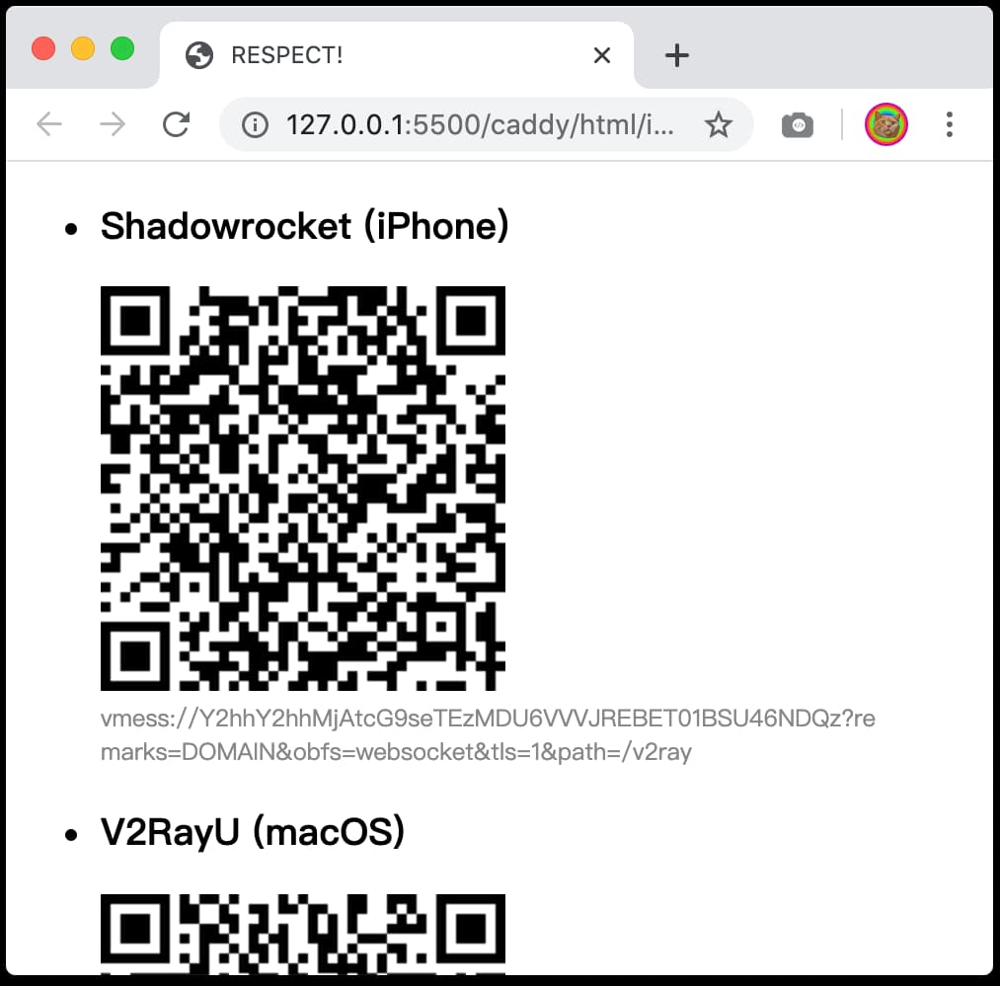

内置应用版本号:

- caddy: `2.2.1`（释放日期：`2020-10-14`）
- v2ray: `v4.31.0`（释放日期：`2020-10-09`）

使用方法:

```
docker pull nekocode/v2ray:latest

# 将下面的 YOUR_DOMAIN 替换成已经解析到你服务器的域名:
docker run -d -p 80:80 -p 443:443 -e DOMAIN=YOUR_DOMAIN nekocode/v2ray:latest

# 此外，你还可以为 V2Ray 设置固定的 UUID（否则容器每次启动会自动生成随机 UUID）
docker run -d -p 80:80 -p 443:443 -e DOMAIN=YOUR_DOMAIN -e UUID=YOUR_UUID nekocode/v2ray:latest
```

容器启动后访问你的域名，会得到以下页面：



*Tip: 如果不想该页面太容易暴露出去的话，可以绑定子域名来提高隐匿性，例如 `secret0.yourdomain.com`*
